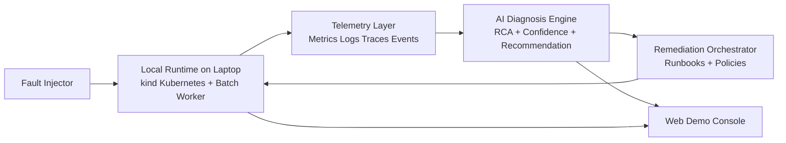
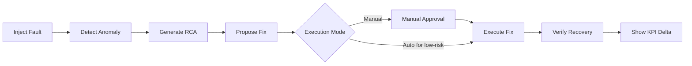

# AI Infrastructure Resilience Copilot

## 1. Business Problem
Modern cloud estates run many workloads across Kubernetes, compute, and batch systems.
When incidents happen, teams spend too long identifying root cause and applying safe fixes.
This increases downtime, operational cost, and customer impact.

## 2. Proposed Product
AI Infrastructure Resilience Copilot is a demo platform that:
- detects infrastructure anomalies in near real time,
- explains likely root cause with evidence,
- recommends safe remediation actions,
- executes approved fixes and verifies recovery.

The goal is to prove measurable reduction in incident detection and recovery time.
The MVP runs fully on a laptop for development and demos using a local `kind` Kubernetes cluster.

## 3. Architecture (Demo Scope)

## 4. Local-First Demo Setup
- Product services run locally via containers.
- Infrastructure runs in a local `kind` cluster.
- Fault scenarios are injected locally without cloud dependencies.
- This keeps demos repeatable, portable, and cost-efficient.

## 5. Live Demo Flow

## 6. MVP Fault Scenarios
- Kubernetes pod crash due to bad config.
- CPU or memory saturation causing service degradation.
- Failed batch job due to dependency timeout.
- Faulty deployment rollout requiring rollback.

## 7. Safety Guardrails
- Default mode is manual approval before remediation.
- Policy checks prevent high-risk actions outside approved scope.
- Blast radius controls limit action to target service or namespace.
- Full audit trail records decision, action, and outcome.

## 8. Success Metrics for Customer Demo
- MTTD: mean time to detect.
- MTTR: mean time to recover.
- Auto-resolve rate for approved low-risk incidents.
- Estimated downtime cost avoided.

## 9. Delivery Snapshot
- Duration: 4 to 6 weeks.
- Team: 2 to 4 engineers.
- Phasing:
  1. Detection + RCA dashboard.
  2. Suggested remediation with approval.
  3. Controlled auto-remediation for low-risk scenarios.

## 10. Why This Demonstrates AI Capability
This is not a generic chatbot demo.
The product uses AI to make operational decisions with guardrails, execute actions, and show measurable business outcomes in a live infrastructure environment.
